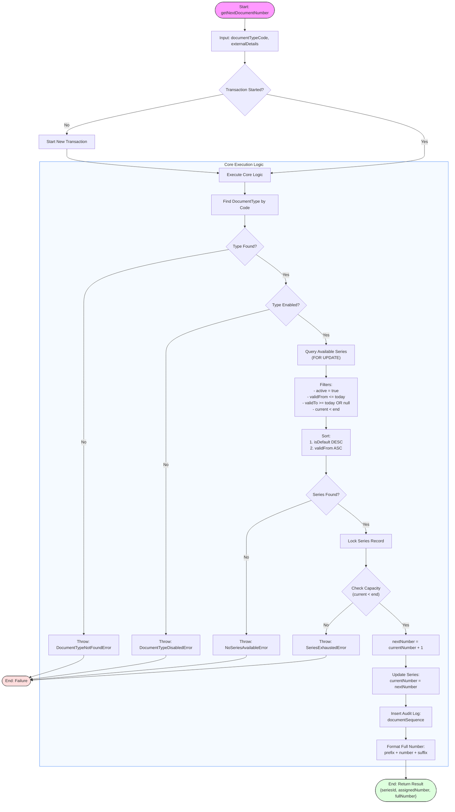

# Numbering Module Flowchart

This document illustrates the logical flow for generating the next sequential number for a specific document type within the Numbering Module. This process ensures data integrity, concurrency control, and auditability.

## Description
The flowchart above details the `getNextDocumentNumber` process defined in `svc/numbering/getNextDocumentNumber.ts`. It handles:
1.  **Validation**: Verifies the document type is valid and enabled.
2.  **Concurrency**: Uses database transactions and row locking (`FOR UPDATE`) to prevent race conditions when multiple users request a number simultaneously.
3.  **Series Selection**: Automatically picks the best series based on validity dates and priority (default series first).
4.  **Auditing**: Every assigned number is logged in the `documentSequence` table to link the number to the external business document (Order, Invoice, etc.).
